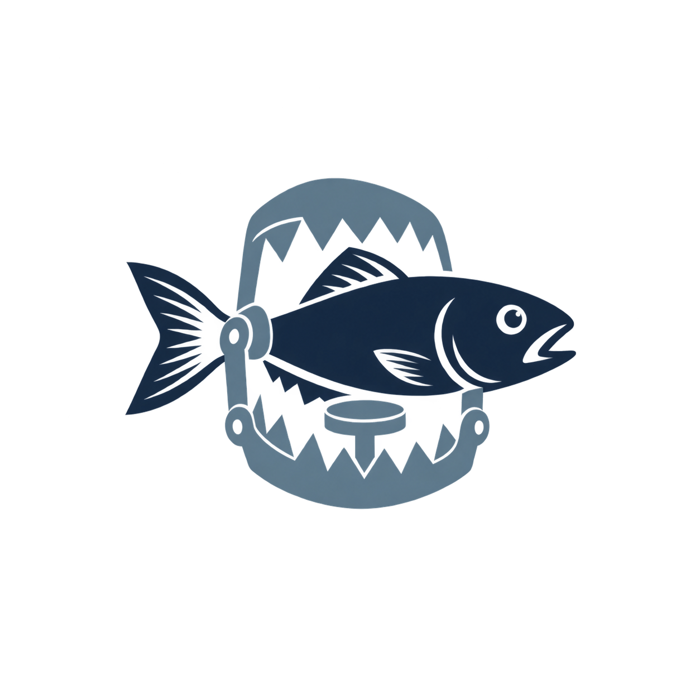



  

<h1 align="center">Trickfish</h1>

<strong>Sound positions. Difficult decisions.</strong>

An experimental chess engine project exploring practical strength, tactical traps, and risk-aware move selection.

---

## Overview

Trickfish explores a question at the intersection of chess search and opponent modeling: **when several moves preserve a sound position, which one makes the opponent's next decision hardest?**

The project aims to combine objective position assessment with an estimate of practical difficulty. Its intended style favors credible threats, concealed tactical resources, and positions where natural replies can carry a cost. Every such preference must remain subject to verification against strong defense.

A successful trap should offer practical upside without depending on the opponent making a mistake for the position to remain playable.

## Project status

**Design stage.** This repository currently contains the project documentation and visual identity. The engine, interfaces, and evaluation framework described below are planned work. There is no playable release or measured playing-strength claim yet.

## Design principles

- **Soundness before temptation.** Reject attractive traps when a verified reply exceeds the configured risk tolerance.
- **Position-dependent risk.** Account for tactical volatility, evaluation uncertainty, and the game situation when setting the acceptable loss of objective value.
- **Plausible opposition.** Estimate which replies an opponent is likely to consider; a losing reply that nobody would play has little practical value.
- **Reproducible decisions.** Preserve candidate evaluations, search limits, configuration, and selection reasons for analysis.
- **Measured progress.** Validate strength and practical behavior separately rather than treating a distinctive style as proof of improvement.

## Planned architecture

| Component | Responsibility |
| :--- | :--- |
| Position core | Board state, legal move generation, make/unmake, repetition, and game termination |
| Search | Iterative deepening, alpha-beta search, quiescence, move ordering, and transposition storage |
| Evaluation | Material, activity, king safety, pawn structure, and positional assessment |
| Candidate verification | Re-examine promising moves and reject tactically unsound alternatives |
| Opponent model | Estimate plausible replies and defensive difficulty for a specified playing profile |
| Selection policy | Rank eligible candidates by objective value and estimated practical opportunity |
| Interfaces | Terminal analysis and UCI integration for compatible chess software |
| Test framework | Move-generation checks, tactical regression suites, and controlled match experiments |

Opponent modeling should influence the choice among verified candidates while leaving legal move generation and search correctness independently testable.

## Move-selection model

The initial research direction uses a two-stage policy:

1. **Establish eligibility.** Search candidate moves and retain those within a position-dependent loss budget relative to the strongest evaluated candidate. Forced tactical outcomes require explicit handling.
2. **Assess practical opportunity.** Rank eligible moves using their objective value, the estimated likelihood and cost of plausible mistakes, and the difficulty of finding adequate defense.

The loss budget is a search-based estimate, not a guarantee of safety. Deeper analysis can overturn an evaluation. Verification effort and uncertainty handling are therefore part of the design, especially in sharp positions.

Human-like play is a modeling objective to test against data, not something established by choosing a lower-ranked move or adding randomness.

## Validation strategy

Planned evaluation covers three separate questions:

- **Correctness:** perft positions, special-move cases, state restoration, repetition, and terminal positions.
- **Strength:** tactical regressions and paired engine matches with fixed hardware, time controls, opening sets, and reported uncertainty.
- **Practical effect:** comparison with an objective-only baseline, followed by tests against defined opponent profiles and held-out human play data where appropriate.

Reports should include objective evaluation loss, defensive resources, trap conversion, and failure cases. No Elo estimate or claim of human resemblance will be treated as established without supporting experiments.

## Development milestones

- [ ] Correct position representation and legal move generation
- [ ] Baseline search and evaluation
- [ ] CLI analysis and UCI support
- [ ] Candidate verification and configurable risk budgets
- [ ] Practical move selection and opponent modeling
- [ ] Reproducible benchmarks and documented results

## Development and contributions

Implementation language, build instructions, and executable examples will be documented when the initial engine lands. Early discussion is welcome through [issues](https://github.com/ceemv22/trickfish/issues), especially around search design, reproducible test positions, and evaluation methodology.

For a proposed tactical test, include the FEN, candidate move, strongest known defense, and the analysis conditions needed to reproduce the result.

## License

A project license has not yet been selected. Licensing and third-party dependencies will be reviewed before the first release.
