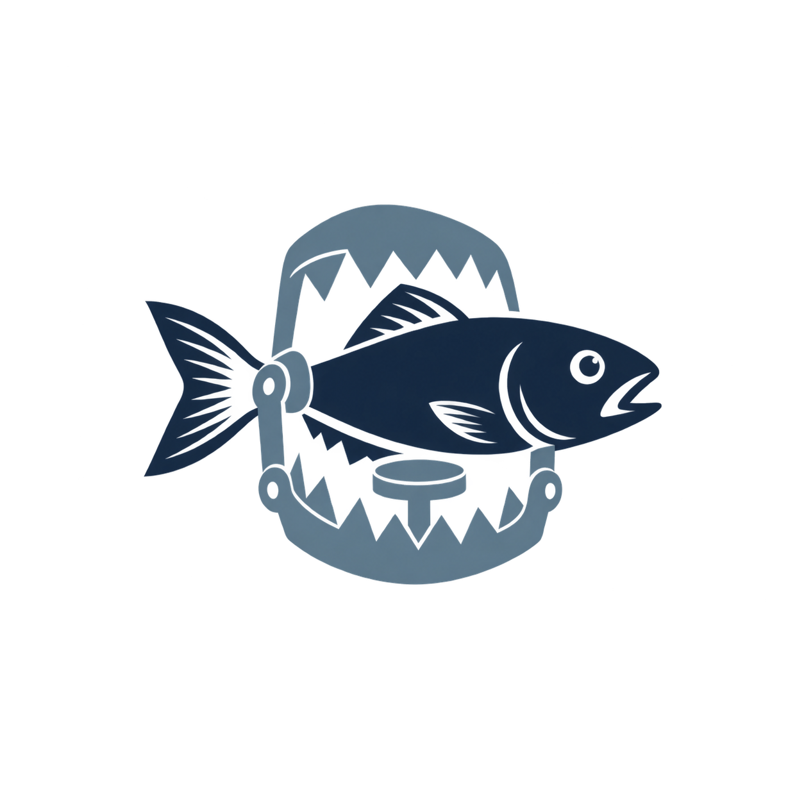

<p align="center">
  
</p>

<h1 align="center">Trickfish</h1>

Trickfish is a chess-engine research project with a Python reference engine and a C++ performance core. Its long-term goal is to select, among objectively acceptable moves, the move whose adequate defense is hardest to find and execute. Candidate verification and practical move selection are planned; they are not part of the current search.

## Current implementation

Python provides the reference rules, positional evaluation, search, and current UCI interface. C++ provides mutable position state, legal move generation, perft, a material evaluator, and an initial search implementation. The two evaluators are not equivalent. No playing-strength or Elo claim has been established.

### Python reference engine

| Area | Current state |
| --- | --- |
| FEN | Parse, validate, render, and serialize |
| Board state | Immutable 64-square tuple |
| Move representation | Immutable UCI-coordinate move value |
| Move application | Immutable successor position with clocks, rights, en passant, promotion, and castling updates |
| Pseudo-legal moves | Knight, bishop, rook, queen, king, and pawn moves |
| Pawn support | Single step, double step, ordinary captures, promotion, and en passant |
| Castling | Rights, piece placement, empty path, and attack checks for the king's route |
| Attack map | Detect attacks by either side without changing side to move |
| Game state | Check, checkmate, stalemate, and ongoing-position status |
| Evaluation | Phase-aware white-positive score with material, activity, pawn structure, bishop pair, rook files, king safety/activity, mate, and dead-position terms |
| Search | Iterative deepening, deadline control, negamax, alpha-beta, capture-first ordering, quiescence, Zobrist transposition table, principal variation, and node count |
| Position key | Deterministic 64-bit Zobrist key for board, side, castling, and legal en passant state |
| Game history | Immutable position sequence with threefold-repetition counting |
| Draw rules | Threefold repetition, 50/75-move thresholds, and insufficient-material detection |
| Perft | Recursive legal-node counter with standard positions through depth 3 and root divide |
| CLI | Position display, status, evaluation, depth-limited search, legal/pseudo-legal move listing, perft, and divide |
| UCI | Handshake, readiness, new game, startpos/FEN with moves, depth/movetime/clock search, stop, bestmove, and quit |
| Tests | FEN, move values, legal filtering, move application, CLI, and perft |

`moves` reports legal moves after applying each candidate and checking the moving side's king. `pseudo-moves` exposes the raw generator for debugging. Castling checks the king's starting, transit, and destination squares against the attack map.

### C++ performance core

| Area | Implemented scope |
| --- | --- |
| Position | Twelve piece bitboards, 64-square mailbox, cached side occupancy, clocks, castling rights, and en passant state |
| Updates | Reversible make/unmake for ordinary moves, captures, promotions, en passant, and castling |
| Move generation | Fixed-capacity move list, all-piece pseudo-legal generation, castling path checks, and legal filtering |
| Attacks | Compile-time pawn/knight/king tables, blocker-aware sliding attacks, aggregate attack maps, and targeted king check detection |
| Position key | Incremental deterministic 64-bit Zobrist key with undo restoration; every recorded en passant file is hashed |
| Game state | Check, checkmate, stalemate, and conservative insufficient-material detection |
| Evaluation | White-positive material score, mate/stalemate/insufficient-material handling, and side-to-move score conversion |
| Search | Negamax, alpha-beta, mate-distance scores, capture/promotion ordering, quiescence, bounded TT, and iterative deepening |
| TT | Full-key checks, depth-qualified exact/lower/upper bounds, mate-score normalization, and preferred-move ordering |
| Output | Best root move, legal main-search PV, side-to-move score, completed depth, and accumulated node count |
| Perft | Recursive node count and root divide |

C++ has no UCI loop, deadline/external-stop control, repetition history, move-count draw adjudication, positional evaluation, or advanced pruning yet. Its Zobrist en passant treatment is not yet suitable for repetition equivalence; Python includes only legal en passant state in that key.

Quiescence searches captures, en passant, and promotions. In check it searches all legal evasions and disables stand-pat. It is capped at 32 quiescence plies; after checking terminal states, the cap returns material even if the position is still in check. This is a safety truncation, not a guarantee of tactical completeness. Main search accepts depths 1 through 64. TT entries are used by main search, not quiescence.

`--search` runs depths successively with a shared TT and reports the last completed depth. It stops terminal roots after the first iteration. The reported PV covers selected main-search moves, excludes quiescence continuations, and may truncate at TT cutoffs or terminal/draw states. It is not guaranteed to reach the reported depth. Search has no time limit or external stop signal yet. `--search-nodes` caps main/quiescence node visits across all iterations. On budget exhaustion it restores position state and returns the last completed iteration; before depth one completes it returns a legal fallback with depth 0, an empty PV, and `stopped true`. Root fallback preparation is outside the node budget. `--divide` prints the node count under each legal root move and the total.

### Verification coverage

The C++ workflow is configured to build with GCC on Linux and MSVC on Windows. It runs initial-position FEN round-trip, depth-3 perft on four positions, divide fixtures, and CLI material/game-state/evaluation fixtures. CTest adds position-state restoration, incremental-key and occupancy checks, targeted check detection parity, TT storage/score normalization, and search regressions including TT-disabled and iterative comparisons.

The configured perft counts are 8,902 for the initial position, 97,862 for Kiwipete, 2,812 for the endgame fixture, and 9,467 for the promotion/check-evasion fixture. These are acceptance targets, not a statement that an uninspected commit has passed CI. Check the Actions result for the exact commit being reviewed. Perft verifies move-generation behavior on those trees; it does not establish search quality or playing strength. Passing search fixtures establishes those regression cases, not general tactical correctness or evaluator parity with Python.

[PROGRESS.md](PROGRESS.md) records a weighted C++ implementation-scope index. Its percentages are planning arithmetic, not measured progress toward world-class playing strength. Implementation and exact-commit CI confirmation are tracked separately.

## Running the prototype

Run from the repository root in PowerShell:

```powershell
$env:PYTHONPATH="src"

python -m trickfish.cli
python -m trickfish.cli moves
python -m trickfish.cli pseudo-moves
python -m trickfish.cli status "7k/6Q1/6K1/8/8/8/8/8 b - - 0 1"
python -m trickfish.cli eval "7k/8/8/8/8/8/8/KQ6 w - - 0 1"
python -m trickfish.cli eval-detail
python -m trickfish.cli search 3
python -m trickfish.cli search-time 1000
python -m trickfish.cli moves "8/7k/8/8/3Q4/8/K7/8 w - - 0 1"
python -m trickfish.cli perft 3
python -m trickfish.cli divide 3
python -m trickfish.uci
python -m unittest discover -s tests -v
```

## Engine direction

Trickfish is being designed around two separate measurements:

1. **Objective result:** the evaluation after the strongest defense found by search.
2. **Practical result:** the difficulty and consequence of the opponent's plausible responses.

The planned practical measurement is a selection constraint. It will be applied only after candidate moves pass an objective-loss limit and tactical re-search.

For a candidate move `m`, the eventual selection stage will compare:

```text
objective value after best defense
evaluation uncertainty
number and quality of defensive resources
cost of likely defensive mistakes
time required to find adequate defense
game context and configured risk budget
```

The relevant failure case is a trap that works only when the opponent misses one obvious response. Candidate verification must identify and reject that case.

## Planned core

| Layer | Responsibilities |
| --- | --- |
| Position | Piece placement, side to move, castling, en passant, clocks, make/unmake, repetition state, Zobrist key |
| Move generation | Pseudo-legal moves, attack maps, legal filtering, promotions, en passant, castling, perft |
| Search | Iterative deepening, alpha-beta, quiescence, transposition table, move ordering, pruning, extensions, time control |
| Evaluation | Material, pawn structure, mobility, king safety, threats, passed pawns, space, endgame scaling |
| Candidate verification | Re-search of selected candidates, tactical stability checks, uncertainty tracking |
| Practical selection | Candidate eligibility, defensive-resource analysis, opponent-response model, risk-budget policy |
| Interfaces | UCI protocol, command-line analysis, structured analysis output |
| Measurement | Perft suite, tactical regression suite, SPRT engine matches, fixed opening sets, reproducible hardware and time controls |

## Development sequence

### Python reference

- [x] Legal rules, FEN, immutable move application, and multi-position perft
- [x] Legal-en-passant Zobrist keys, repetition history, and draw-rule helpers
- [x] Phase-aware positional evaluation and explainable breakdown
- [x] Alpha-beta, quiescence, TT, iterative deepening, and principal variation
- [x] Deadline-based search and UCI depth/movetime/clock/stop support

### C++ core

- [x] Mutable bitboards, mailbox, occupancy, and reversible updates
- [x] Complete legal move generation, attack detection, perft, and divide
- [x] Incremental Zobrist keys and restoration regression fixtures
- [x] Material evaluation with terminal and insufficient-material handling
- [x] Depth-limited alpha-beta with mate-distance scores
- [x] Capture/promotion ordering and quiescence with check evasions
- [x] Bounded TT with score normalization and depth-qualified bounds
- [x] Iterative deepening with shared TT and completed-depth reporting
- [x] Legal principal variation output with explicit TT truncation
- [x] Node budget with state restoration and completed-iteration fallback
- [ ] Time limits and external stop handling
- [ ] Repetition-equivalent keys, history, and move-count draw policy
- [ ] Positional evaluation and endgame scaling
- [ ] C++ UCI interface
- [ ] Advanced ordering, pruning, extensions, and measured optimization
- [ ] Reproducible benchmarks, tuning, self-play, and SPRT matches

### Research layers

- [ ] Candidate verification
- [ ] Practical move selection
- [ ] Opponent-specific experiments and published benchmark methodology

Checked items indicate implemented scope. They do not certify the latest commit's CI result or playing strength.

## Language plan

The current Python code exists to establish rules, tests, and the decision model quickly. It is not intended to be the final high-performance search core.

The target architecture is a C++26 engine core for position updates, move generation, search, and evaluation. The actual build baseline is C++23 (`cxx_std_23` in `CMakeLists.txt`), with compiler extensions disabled. C++26 is an architectural target, not the currently required compiler standard. Python remains the behavioral reference and supports tooling, experiments, fixtures, data preparation, and analysis.

The C++ core is under `cpp/`. Local C++ compilation and runtime execution have not been established in the current development environment; GitHub Actions provides the configured GCC/MSVC build and runtime verification. The commands below require an installed CMake and compatible compiler.

Windows with Visual Studio:

```powershell
cmake -S . -B build -A x64
cmake --build build --config Release
ctest --test-dir build -C Release --output-on-failure
.\build\Release\trickfish_cpp.exe --perft 3
.\build\Release\trickfish_cpp.exe --divide 3
.\build\Release\trickfish_cpp.exe --material
.\build\Release\trickfish_cpp.exe --eval
.\build\Release\trickfish_cpp.exe --status
.\build\Release\trickfish_cpp.exe --search 3
.\build\Release\trickfish_cpp.exe --search-nodes 6 10000
```

Linux with a single-configuration generator:

```sh
cmake -S . -B build -DCMAKE_BUILD_TYPE=Release
cmake --build build
ctest --test-dir build --output-on-failure
./build/trickfish_cpp --search 3
```

`--material`, `--eval`, `--eval-stm`, `--status`, and `--insufficient-material` accept an optional quoted FEN. `--perft`, `--divide`, and `--search` accept a depth followed by an optional quoted FEN. `--search-nodes` accepts depth, a non-negative node limit, and an optional quoted FEN. Without a FEN, commands use the initial position. `--eval` is white-positive; `--eval-stm` and search scores are side-to-move positive. Mate scores use a separate magnitude of 100,000, with search adjusting for distance. Search output is a diagnostic CLI, not a C++ UCI session.

## Verification standard

Rule and state changes require focused behavioral checks and established perft baselines. Search changes require regression cases and comparison with a reference path where applicable. Report local checks separately from the Actions result for the exact pushed commit. Playing-strength changes require controlled matches with reproducible hardware, openings, and time controls. Practical-selection work requires its own evaluation methodology.

## License

No license has been selected.
